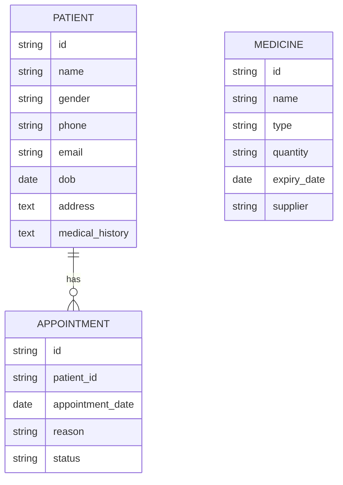

Perfect 👍 — since you’ve already provided:

* the **DrTracker project structure documentation**, and
* the **Figma UI screens** (which clearly show patient dashboard, add/edit forms, inventory, appointment management, and patient detail modals),

I now have enough information to create a **comprehensive high-level blueprint (`masterplan.md`)** for your app.

Here’s the complete **masterplan.md**:

---

# DrTracker — Master Plan

## 1. App Overview

**DrTracker** is a modern, web-based patient management system designed for clinics and healthcare professionals.
It streamlines patient tracking, appointment scheduling, and medical inventory management within a single, responsive interface.

### Objectives

* Simplify daily clinic operations through an integrated digital workflow.
* Enable quick access to patient data, prescriptions, and visit history.
* Maintain accurate medicine inventory and track stock levels.
* Provide intuitive, user-friendly dashboards for doctors and staff.

### Vision

To evolve DrTracker into a modular healthcare platform supporting small-to-mid-sized clinics — with potential scalability into cloud-based multi-clinic networks.

---

## 2. Target Audience

* **Primary Users:** Doctors, clinic administrators, receptionists
* **Secondary Users:** Healthcare support staff and pharmacists

Key pain points solved:

* Manual record-keeping inefficiencies
* Poor appointment visibility
* Lack of unified access to patient history and inventory data

---

## 3. Core Features & Functionality

### 3.1 Patient Management

* Add, edit, and delete patient profiles
* Quick search and filtering by patient name or ID
* Access full patient history with visit logs and prescriptions

### 3.2 Appointment Scheduling

* Daily and weekly appointment overviews
* Add/edit appointment modals
* Quick “upcoming appointments” summary on dashboard

### 3.3 Inventory Management

* Medicine inventory listing with expiry alerts and low-stock highlights
* Add new medicines, edit quantities, and manage purchase history
* Filter and sort inventory items by name, category, or status

### 3.4 Dashboard & Reports

* Overview cards (Total Patients, Today’s Appointments, Medicine Stock, etc.)
* Activity tracking and quick navigation shortcuts
* Future-ready space for charts/analytics integration

### 3.5 Theme Customization

* Customizable primary color, density, and layout spacing via ThemeContext
* Consistent Ant Design-based UI components

### 3.6 Future (Planned) Features

* Authentication (JWT + role-based access)
* Medicine vendor integration
* Analytics dashboard for patient trends and inventory usage
* Offline PWA support

---

## 4. Platform & Architecture

**Platform:** Web (Single Page Application)
**Architecture:** Component-based SPA using React.js and Ant Design

### 4.1 Structure Summary

* **React Components:** Modular UI elements (Header, Sidebar, Tables, Modals)
* **Context Providers:** PatientContext, ThemeContext (global state)
* **Pages:** Dashboard, Patients, Inventory, Appointments
* **Routing:** React Router DOM for page navigation

### 4.2 Integration Path (from current structure)

The existing structure serves as a strong base:

* Add new pages (`InventoryPage.jsx`, `AppointmentsPage.jsx`)
* Extend `PatientContext` to manage appointments and inventory
* Introduce `AuthContext` later for authentication

---

## 5. Conceptual Data Model

Future extensions:

* Add `USER` table (doctors/admins)
* Add `INVOICE` or `PAYMENT` modules

---

## 6. User Interface Design Principles (Based on Figma)

### 6.1 Design Language

* **Framework:** Ant Design (consistent with Figma layout)
* **Color Palette:** Green/white primary scheme (clean, medical aesthetic)
* **Typography:** Clear, sans-serif font hierarchy
* **Layout:** Sidebar navigation + top header
* **Data Presentation:** Card-based summary + table-driven details

### 6.2 Usability Focus

* Minimal clicks to perform frequent actions
* Modal forms for quick edits (seen in Figma)
* Dashboard as central navigation hub
* Responsive layouts for tablet compatibility

---

## 7. Security & Authentication

### Current

* No backend authentication yet (client-side routing only)

### Recommended

1. **JWT-based Authentication**

   * Secure API access
   * Supports role-based authorization (doctor, admin, staff)

2. **Best Practices**

   * Use HTTPS for all API communications
   * Encrypt sensitive patient data (at rest & in transit)
   * Input validation and form sanitation

---

## 8. Tech Stack Recommendations

| Layer                | Technology                   | Reason                                          |
| -------------------- | ---------------------------- | ----------------------------------------------- |
| **Frontend**         | React.js + Ant Design        | Familiar, fast, and matches Figma design        |
| **State Management** | React Context + Reducer      | Simple, scalable for medium complexity          |
| **Routing**          | React Router DOM             | Seamless SPA navigation                         |
| **Backend (Future)** | Node.js (Express) + MongoDB  | JSON-friendly, flexible schema for patient data |
| **Deployment**       | Vercel / Netlify (Frontend)  | Fast CI/CD for SPAs                             |
| **Testing**          | Jest + React Testing Library | Unit and UI testing                             |
| **Version Control**  | GitHub                       | Collaboration and CI integration                |

---

## 9. Development Phases / Milestones

| Phase       | Description                      | Deliverables                             |
| ----------- | -------------------------------- | ---------------------------------------- |
| **Phase 1** | Core UI & Patient Module         | Dashboard, Patients Page, Add/Edit Forms |
| **Phase 2** | Appointments & Inventory         | Inventory table, Appointment scheduling  |
| **Phase 3** | Authentication & Role Management | JWT auth, user roles                     |
| **Phase 4** | Performance & PWA Enhancements   | Lazy loading, caching, offline access    |
| **Phase 5** | Advanced Features                | Reports, analytics, mobile app support   |

---

## 10. Potential Challenges & Solutions

| Challenge                                 | Solution                                                  |
| ----------------------------------------- | --------------------------------------------------------- |
| Large data rendering (patients/inventory) | Use pagination + virtualization                           |
| State complexity                          | Modularize Contexts or migrate to Zustand/Redux if needed |
| Data syncing                              | Introduce backend with REST APIs                          |
| Authentication security                   | Use secure token storage and short-lived tokens           |

---

## 11. Future Expansion

* **Mobile App** using React Native (shared components possible)
* **EHR (Electronic Health Record) Integration** for hospitals
* **Analytics Dashboard** for clinic insights
* **Multi-Clinic SaaS Model** (centralized backend with multi-tenancy)
* **AI-based Medical Insights** (future R&D path)

---

## 12. Summary

DrTracker’s current React foundation and Figma design align perfectly for an efficient SPA architecture.
By progressively enhancing state management, authentication, and backend connectivity, the app can grow from a clinic tool into a full-fledged healthcare management platform.

---

*Generated by: CTO Assistant*
*Date: October 31, 2025*

---