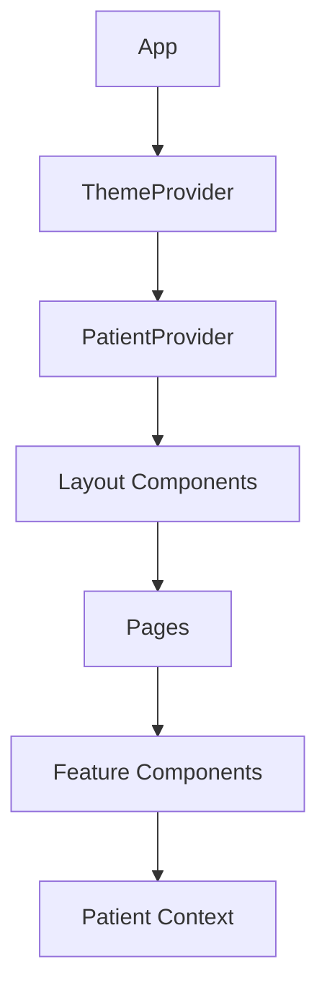

# DrTracker - Project Structure Documentation

## 1. Project Overview

DrTracker is a modern patient management system designed to help medical professionals track and manage patient information, appointments, and medical inventory efficiently.

### Purpose and Objectives
- Streamline patient record management
- Track daily appointments and patient visits
- Manage medicine inventory
- Provide quick access to patient history and medical records

### Target Users
- Doctors
- Medical clinic staff
- Healthcare administrators

## 2. System Architecture

### High-Level Overview
DrTracker follows a single-page application (SPA) architecture built with React.js, featuring:
- Component-based UI architecture
- Context-based state management
- Theme customization system
- Responsive layout design

### Major Modules
1. **Core Application (App.js)**
   - Routing configuration
   - Layout management
   - Theme provider integration

2. **Patient Management**
   - Patient context provider
   - Add patient functionality
   - Patient listing and search

3. **UI Components**
   - Reusable components
   - Theme customization
   - Layout components

### Data Flow


## 3. Tech Stack

### Frontend Framework & Libraries
- **React.js**: v19.2.0 - Core framework
- **React Router DOM**: v7.9.5 - Routing
- **Ant Design**: v5.27.6 - UI component library
- **@ant-design/icons**: v6.1.0 - Icon system

### Development Tools
- **react-scripts**: v5.0.1 - Build tooling
- **web-vitals**: v2.1.4 - Performance monitoring

### Testing Framework
- **@testing-library/react**: v16.3.0
- **@testing-library/jest-dom**: v6.9.1
- **@testing-library/user-event**: v13.5.0

## 4. Directory & File Structure

```
drtracker/
├── public/
│   ├── index.html          # Entry HTML
│   ├── manifest.json       # PWA manifest
│   └── robots.txt         # SEO configuration
├── src/
│   ├── components/        # Reusable UI components
│   │   ├── AddPatientForm.jsx
│   │   ├── HeaderBar.jsx
│   │   ├── Sidebar.jsx
│   │   └── ThemeCustomizer.jsx
│   ├── context/          # React Context providers
│   │   └── PatientContext.jsx
│   ├── pages/           # Route components
│   │   ├── OverviewPage.jsx
│   │   └── PatientsPage.jsx
│   ├── App.js           # Root component
│   ├── index.js         # Application entry
│   └── themeContext.js  # Theme management
└── package.json         # Dependencies and scripts
```

## 5. Data Flow & Architecture Patterns

### State Management
- Uses React Context API for global state management
- Separate contexts for:
  - Patient data (PatientContext)
  - Theme customization (ThemeContext)

### Component Architecture
- Follows atomic design principles
- Hierarchy:
  1. Pages (container components)
  2. Feature components (business logic)
  3. UI components (presentation)

## 6. Security & Authentication

### Current Implementation
- Basic client-side routing security
- No authentication system implemented yet

### Recommendations
- Implement JWT-based authentication
- Add role-based access control
- Secure API endpoints when backend is implemented

## 7. Testing & Quality Assurance

### Testing Setup
- Jest test runner
- React Testing Library
- Basic component tests included

### Test Coverage
- Basic component rendering tests
- More comprehensive testing needed for:
  - Form validation
  - State management
  - User interactions

## 8. Performance & Scalability Analysis

### Current Performance
- Lightweight bundle size
- Client-side rendering
- Efficient component re-rendering through Context

### Optimization Opportunities
- Implement code splitting
- Add service worker for offline capability
- Optimize large list rendering
- Add data caching

## 9. Future Improvements / Roadmap

### Short-term Improvements
1. Implement authentication system
2. Add proper form validation
3. Implement medicine inventory management
4. Add appointment scheduling system

### Long-term Goals
1. Integration with electronic health records (EHR)
2. Advanced analytics dashboard
3. Mobile application development
4. Multi-language support

## 10. Appendix

### Environment Setup
```bash
# Install dependencies
npm install

# Start development server
npm start

# Run tests
npm test

# Create production build
npm run build
```

### Key Dependencies
- React.js: Frontend framework
- Ant Design: UI components
- React Router: Navigation
- Testing Library: Testing utilities

### Development Guidelines
- Follow React best practices
- Use functional components with hooks
- Maintain consistent code formatting
- Write tests for new features

### Theme Customization
The application supports dynamic theme customization through the ThemeContext provider:
- Primary color
- Border radius
- Layout density (compact/default)

---

*Generated on: October 31, 2025*